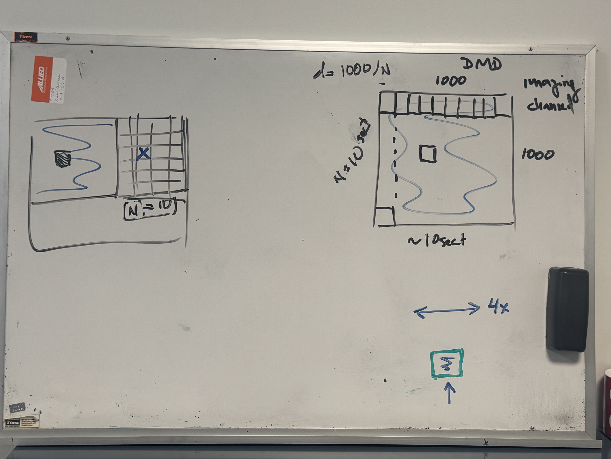

# DMD DLPC900

## ToDos (according to priority)
- [ ] Clean code 
- [ ] Make bmp for blacking out certain sections
- [ ] Fix standby issue
- [ ] Add testing section for dmd
- [ ] Ensure that DMD Communication Status isn't an hardware issue

## Done
- [x] Control exposure and gain in camera
- [x] Turn code into a dll file for python wrapper GUI
- [x] Make python wrapper for GUI
- [x] Continue cleaning out code
- [x] Test Communication Status
- [x] Clean up main.c so that cmd functions are seperated according to its category
- [x] Add comments for functions
- [x] Check the following function for mirror control w/o LEDs: `LCR_GetDMDBlocks()`, `LCR_SetDMDBlocks()`
- [x] Make BMP image display into the screen

## How to run
This software is only **Windows x64** system compatible 
<br>*(Could be compatible with Windows x32 systems but have not been tested or developed in this enviroment)*
1. Open this directory in a CLI *(Note: the CLI may print out errors while compiling. However, most are formatting warnings and the program will run as intended)*
2. Execute build.bat `./build.bat`

## Directory Structure
```
DLPC900_CLI/
├── hidapi/             
│   ├── hid.c *
│   └── hidapi.h *
├── LCR5000YX_Images/ *
│   ├── bmp images *    
├── lib/
│   ├── API.c *
│   ├── API.h *
│   ├── BMPParser.c *
│   ├── BMPParser.h *
│   ├── common.h *
│   ├── compress.c *
│   ├── compress.h *
│   ├── diagnosticFile.c
│   ├── diagnosticwindow.h *
│   ├── Error.c *
│   ├── Error.h *
│   ├── pattern.c *
│   ├── pattern.h *
│   ├── splash.c
│   ├── splash.h
│   ├── usb.c
│   └── usb.h
├── src/
│   └── cmd_connection.c
│   └── cmd_image.c
│   └── cmd_pattern.c
│   └── cmd_status.c
│   └── main.c
├── build.bat
├── dlpc900_cli.exe
├── diagnostic.log
└── README.md
```
**Where `*` means it originated from the DLPC900REF-GUI codebase**

- `hidapi` folder contains USB HID protocal communication
- `LCR500YX_Images` folder contains sample images from the DLPC900 Library
- `lib` folder contains core DLPC900 API Library
- `src` folder contains the main application code

## Important Resources

[DLPC900 Programmer's Guide](https://www.ti.com/lit/ug/dlpu018j/dlpu018j.pdf?ts=1765949573573&ref_url=https%253A%252F%252Fwww.bing.com%252F)
- This document specifies the command and control interface to the DLPC900 controller and defines all **applicable 
commands**, default settings, and control **register bit definitions**.

## Notes
- I'm pretty sure you can turn off the LEDs in all times using the `LCR_SetEnables(0, 0, 0, 0);` but have to check
    - Through this way, the mirrors could be manipulated via BMP images w/o LEDs turning on
- Will be using BMP to control mirrors, now figure out how to turn the BMP into mirrors ON/OF controls
- DMD Mirror Sketch
